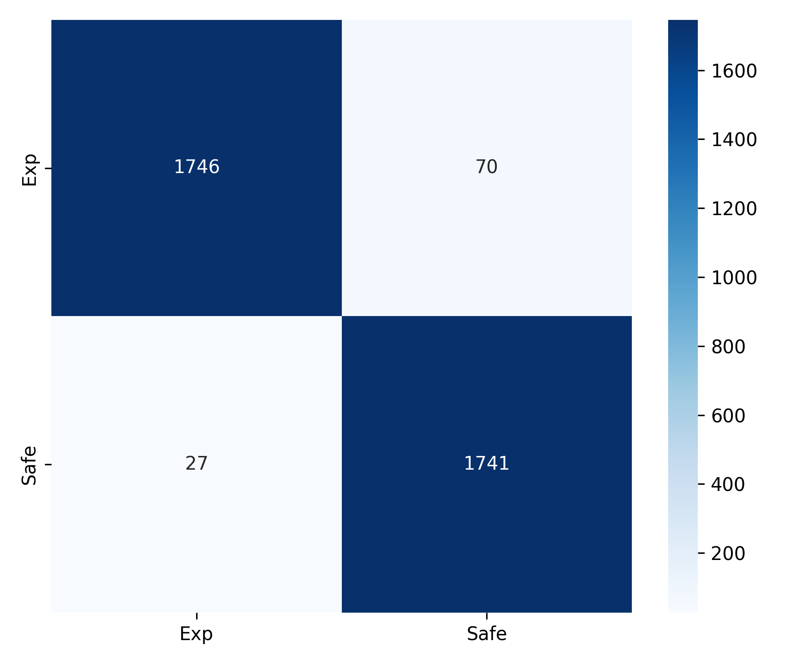

# Explosive Object Detection

A deep learning project for detecting **explosive vs safe objects** using **MobileNetV2** and **TensorFlow Lite**.  
The project includes dataset preprocessing, training with transfer learning, evaluation, and deployment for inference.

---

## Project Structure
Explosive-Object-Detection/

│── preprocess.py # Preprocess and split dataset (train/val/test)

│── train.py # Train MobileNetV2 model and export TFLite

│── inference.py # Run inference using TFLite model

│── models/ # Saved models (best_model.h5, model.tflite)

│── results/ # Training results & evaluation plots

---

## Features
- Dataset preprocessing (resize, clean, split).
- Training with MobileNetV2 + transfer learning.
- Evaluation with confusion matrix and classification report.
- Conversion to **TensorFlow Lite (int8 quantization)**.
- Inference on single images with confidence score.

---

## Installation
Clone the repository and install dependencies:
```bash
git clone https://github.com/Mohammad-Jaafar/Explosive-Object-Detection.git
cd Explosive-Object-Detection
pip install -r requirements.txt
```

## Results

- Best model accuracy: > 80%
- Confusion matrix example:




## Future Work

- Deploy model on mobile app (Android/iOS).
- Extend dataset with more object categories.
- Improve accuracy with advanced augmentations.

This project is licensed under the MIT License - see the [LICENSE](LICENSE) file for details.
